# Hack Assembler

A Go implementation of the Hack Assembler, based on the book [The Elements of Computing Systems](https://www.nand2tetris.org/).

This assembler translates `.asm` programs written in Hack assembly language into `.hack` machine code files.

## Architecture

The application is a Go-implementation of a two-pass assembler for the Hack Assembly language. The architecture is modular, with a clear separation of component responsibilities.

- **Controller (`internal/controller`)**
  - Orchestrates the overall assembly flow, interacting with other modules via interfaces (loader, assembler, exporter).
- **Finite State Machine (FSM) (`internal/fsm`)**
  - Manages the assembly process states (e.g., preparing, processing, exporting, success, error).
- **Loader (`internal/fileio/loader`)**
  - Reads and loads `.asm` files from a specified directory.
- **Parser (`internal/parser`)**
  - Parses assembly code lines, identifies instruction types (A, C, L), and extracts their components (symbols, Dest, Comp, Jump).
- **Symbol Table (`internal/symboltable`)**
  - Manages predefined symbols, variables, and labels, assigning them memory addresses.
- **Coder (`internal/code`)**
  - Converts symbolic parts of C-instructions (Dest, Comp, Jump) into their corresponding binary codes.
- **Assembler (`internal/assembler`)**
  - Implements a two-pass algorithm: the first pass builds the symbol table, the second translates all instructions into binary code.
- **Exporter (`internal/fileio/exporter`)**
  - Writes the generated machine code to `.hack` files.

### Workflow

The application performs the following stages:

1.  **Loading:** Reading `.asm` files.
2.  **Assembling:** Two-pass translation of assembly code to machine code, including symbol resolution and binary instruction generation.
3.  **Exporting:** Writing the resulting `.hack` files to the target directory.

**State Diagram:**

```mermaid
stateDiagram-v2
  [*] --> Idle
      Idle --> Preparing: Start
      Preparing --> Processing: Files loaded
      Preparing --> Error: Failed to load file(s)
      Processing --> Exporting: Assembly completed
      Processing --> Error: Assembly failed
      Exporting --> Success: Files exported
      Exporting --> Error: Export failed
  Success --> [*]: Done — everything succeeded!
  Error --> [*]: Stopped due to an error
```



## Usage

Build the binary:

```bash
make build
```

Run with input and output directories:

```bash
./hackasm -d testdata -o out
```

Or use the provided `Makefile`:

```bash
make run
```

## CLI Flags

- `-d` (required): Path to a single `.asm` file or a directory containing `.asm` files
- `-o` (optional): Output directory for generated `.hack` files (default: `gen`)

Note: When running via `make run`, the flags use default values unless overridden with `in=...` and `out=...`.

## Testing

Run all tests:

```bash
make test
```

## Example

Input file (`Add.asm`):

```asm
@2
D=A
@3
D=D+A
@0
M=D
```

Output file (`Add.hack`):

```text
0000000000000010
1110110000010000
0000000000000011
1110000010010000
0000000000000000
1110001100001000
```
